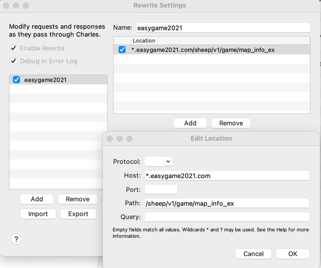
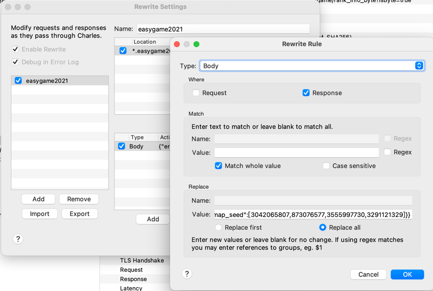

# ylgy

羊了个羊 通关程序，新版本接口已被修改，暂时使用 抓包重写 的方式通关。

## 重写第二关

##### 1、通过下面的链接操作, 让`Charles`可以抓取手机请求。

[Charles抓包教程](https://www.jianshu.com/p/ff85b3dac157)

##### 2、设置 Charles 重写规则

##### 配置 `Location`



##### 配置 `Rewrite Rule`



替换的内容：

```
{"err_code":0,"err_msg":"","data":{"map_md5":["046ef1bab26e5b9bfe2473ded237b572","046ef1bab26e5b9bfe2473ded237b572"],"map_seed":[3042065807,873076577,3555997730,3291121329]}}
```

##### 3、在手机上正常闯关

玩得开心！

## 声明

本项目仅供学习交流，严禁用作商业行为！  
因他人私自不正当使用造成的违法违规行为与本人无关！  
如有任何问题可联系本人删除！

## Buy me a Coffee

如果有帮助到您，并且也使您感到开心的话，可以慷慨的为我买杯coffee吗


<br/>

