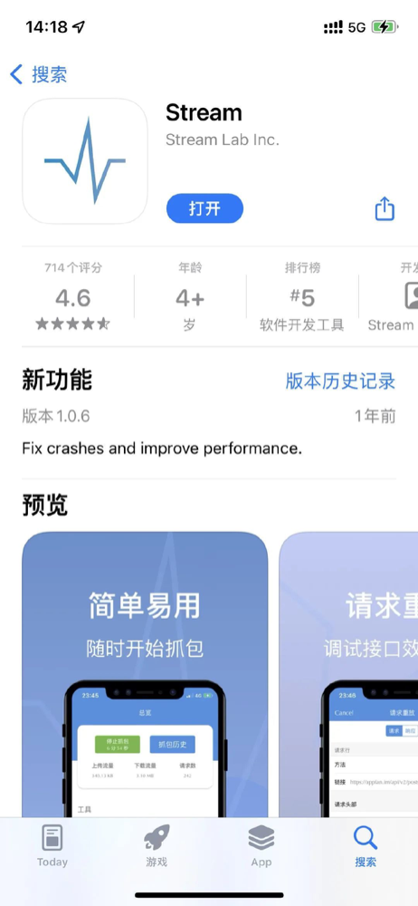
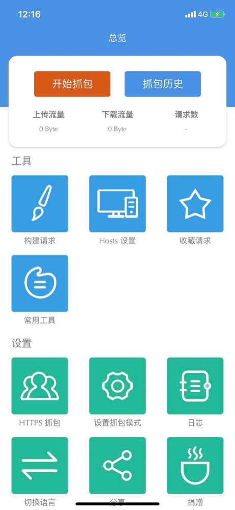
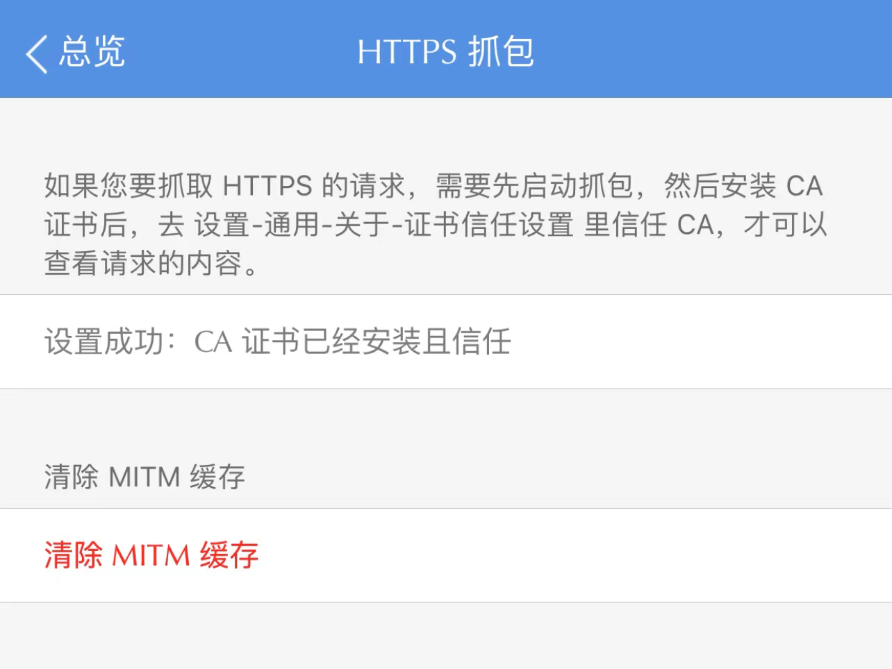
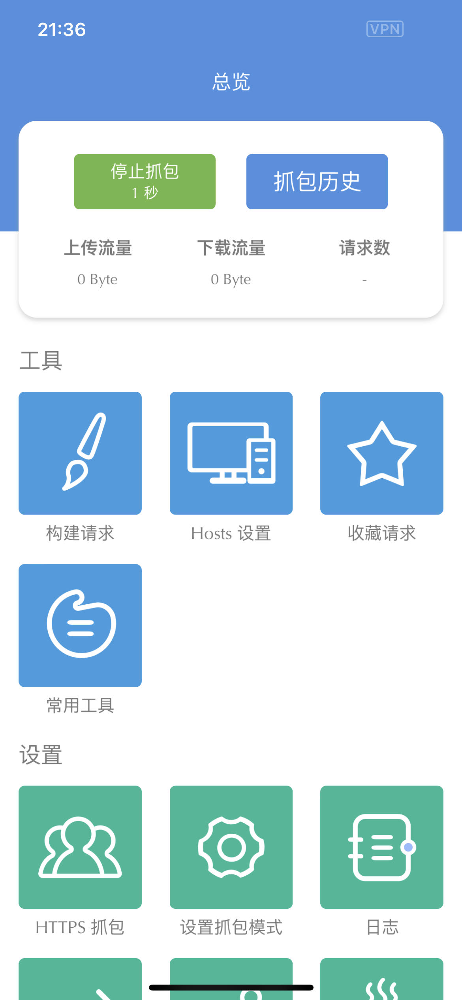
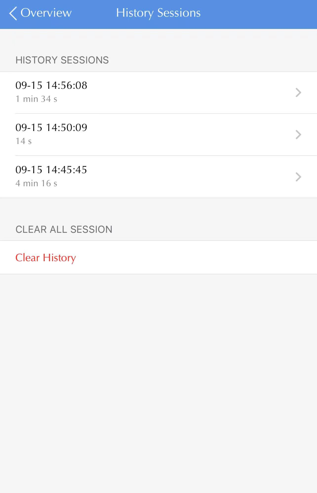
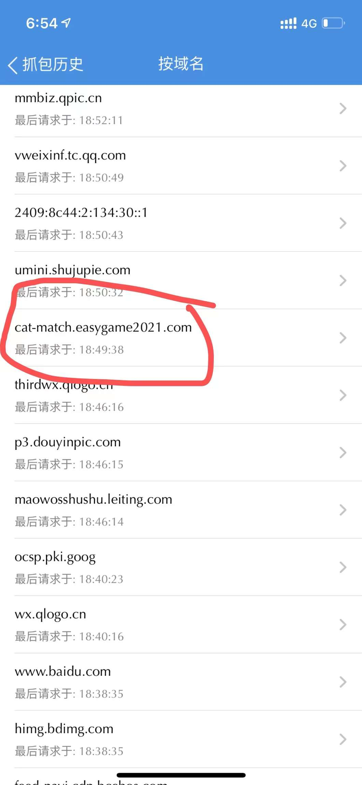

# IOS 抓包

### 1. 前往 App Store 下载安装 Stream



### 2. 打开 Stream



### 3. 配置 HTTPS 抓包

- 需要安装证书，安装成功如下图所示
- 需要点击 清除缓存



### 4. 点击 开始抓包



### 5. 打开微信 --> 访问 羊了个羊 --> 打开排行榜

### 6. 点击 停止抓包

### 7. 点击 抓包历史

### 8. 选择 抓包记录



### 9. 按域名检索，选择 `cat-match.easygame2021.com` 域名记录



### 10. 在详情的请求中，找到 t 对应的内容，就是后续要用到的身份信息，拷贝下来


### 11. 使用本工具执行通关

替换 `<your-custom-token>` 为 上一步获取到的 t 对应的内容

```shell
ylgy --token <your-custom-token>
```